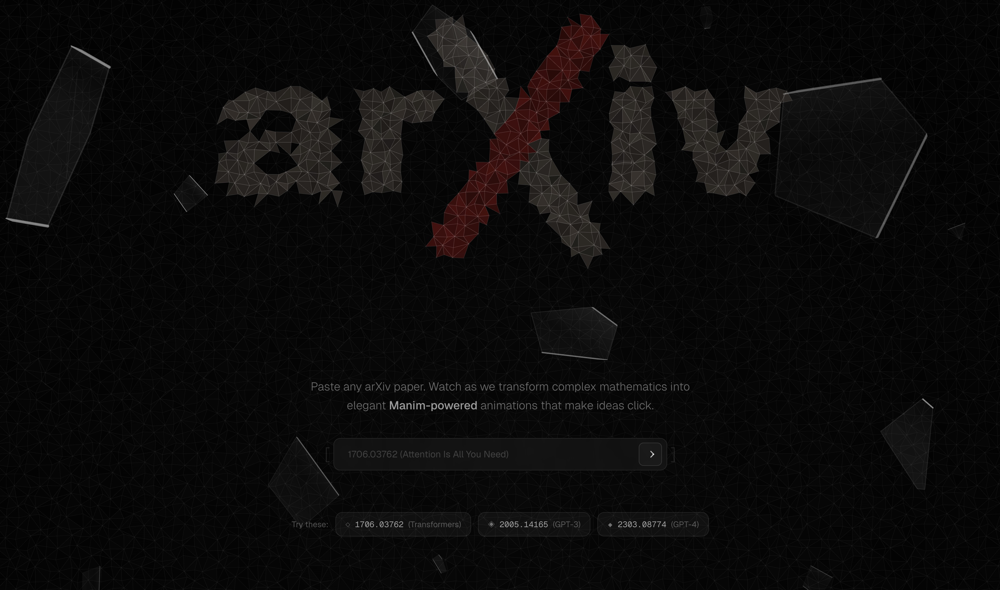
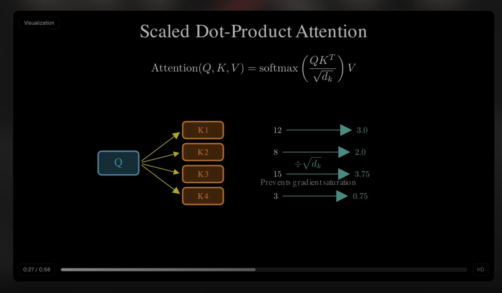
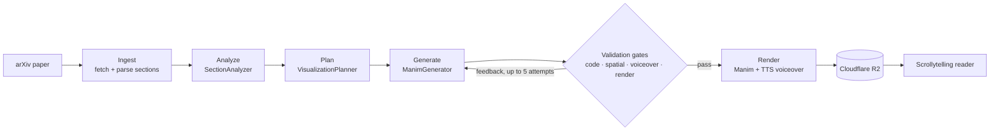

<div align="center">
    
</div>
<h1 align="center">
  <a href="https://www.arxivisual.org/" target="_blank">arXivisual</a>
</h1>
<p align="center">
   Transform research papers into visual stories
</p>

[](https://github.com/user-attachments/assets/5453760b-5f82-4fd1-9a77-fe8818fea059)





## What It Is

arXivisual turns any arXiv paper into an interactive scrollytelling page. Paste a paper URL and a multi-agent pipeline fetches the paper, breaks it into sections, finds the concepts worth animating, and generates 3Blue1Brown-style [Manim](https://www.manim.community/) animations with AI voice narration — then embeds them in a readable, scroll-driven presentation of the paper. Research papers arrive as monoliths; arXivisual turns the fragments into something you can watch.

## Key Features

- **Scrollytelling reader** — papers render section by section with KaTeX math, summaries, and embedded videos that appear as they finish rendering
- **AI-generated Manim animations** — an agent pipeline analyzes each section, storyboards the key concepts, and writes runnable Manim code, hardened by four validation gates (syntax, spatial layout, narration quality, runtime) with automatic retry on failure
- **Voice narration** — animations are `VoiceoverScene`s narrated via Azure OpenAI text-to-speech (`gpt-4o-mini-tts`), timed so each beat matches its narration
- **Explore gallery** — browse every previously processed paper without reprocessing
- **Observable pipeline** — every LLM call and pipeline span is traced in Langfuse with token usage and cost per paper

## Architecture



See [docs/ARCHITECTURE.md](docs/ARCHITECTURE.md) for the full walkthrough.

## Tech Stack

| Layer | Technology |
|-------|------------|
| Frontend | Next.js 16, React 19, Tailwind CSS 4, TanStack Query, Framer Motion, KaTeX |
| Backend | FastAPI (Python 3.11+), managed with [uv](https://docs.astral.sh/uv/) |
| LLM | Azure OpenAI (GPT-5 family) via a provider-switchable agent base |
| Animation | Manim Community + manim-voiceover |
| Text-to-speech | Azure OpenAI `gpt-4o-mini-tts` (gTTS fallback) |
| Database | PostgreSQL in production, SQLite locally (SQLAlchemy async) |
| Video storage | Cloudflare R2 (S3-compatible), local filesystem in dev |
| Observability | Langfuse |
| Hosting | Azure Container Apps (backend), Vercel (frontend) |
| CI | GitHub Actions |

## Quick Start

### Prerequisites

- Node.js 18+
- Python 3.11+ and [uv](https://docs.astral.sh/uv/getting-started/installation/)
- FFmpeg, Cairo, Pango (for Manim); a LaTeX distribution for `MathTex` scenes
- An Azure OpenAI resource with a GPT-5-family deployment (Dedalus Labs works as a legacy fallback provider)

### Backend

```bash
cd backend
cp .env.example .env          # Fill in your Azure OpenAI keys
uv sync
uv run uvicorn main:app --reload --host 0.0.0.0 --port 8000
```

API docs are served at http://localhost:8000/docs. With no `DATABASE_URL` set, the backend uses a local SQLite file; videos are written to `media/videos/`.

### Frontend

```bash
cd frontend
npm install
npm run dev
```

The app runs at http://localhost:3000 and talks to the backend at `http://localhost:8000` by default (override with `NEXT_PUBLIC_API_URL`).

### Environment

All backend configuration lives in environment variables — [backend/.env.example](backend/.env.example) documents every option: LLM provider selection, TTS voice and model, Langfuse keys, storage mode, and render mode.

## Testing

```bash
cd backend
uv sync --extra dev
uv run pytest tests/
```

The suite is fully offline — CI runs it against dummy provider credentials on Python 3.11 and 3.13. Frontend checks are `npx tsc --noEmit` and `npm run build`.

## Deployment

The backend ships as a Docker image to **Azure Container Apps**; the frontend auto-deploys to **Vercel** from `main`. See [docs/DEPLOY.md](docs/DEPLOY.md) for the full procedure, environment reference, and rollback steps.

## Creators

| Name | X |
|------|---|
| Armaan Gupta | [@armaangupt0](https://x.com/armaangupt0) |
| Raj Shah | [@_rajshah6](https://x.com/_rajshah6) |
| Nikhil Hooda | [@_nikhilhooda](https://x.com/_nikhilhooda) |
| Ajith Bondili | [@AjithBondili](https://x.com/AjithBondili) |
